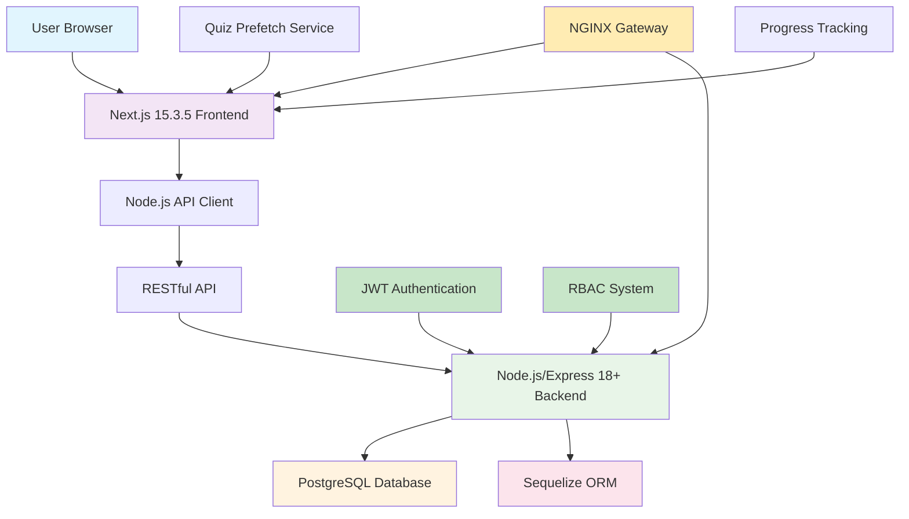

# GlassCode Academy - Fullstack Learning & Interview Trainer

🌐 **[Visit GlassCode Academy](https://glasscode.academy)** - Live Demo & Production Site

## Project Overview

GlassCode Academy is a full-stack educational platform designed to help developers learn and prepare for interviews in modern web technologies. The application provides structured learning resources and realistic interview practice with instant feedback.

For detailed information about the current architecture, see [CURRENT_ARCHITECTURE.md](docs/CURRENT_ARCHITECTURE.md).

> **Note**: This is purely a learning and coding challenge! No real application would (or should) be architored this way. In the real world, you wouldn't run 5+ separate technology stacks just to teach about them. But for the sake of learning and demonstrating proficiency in each technology, we've gone a bit overboard with the architecture. Think of it as an educational extreme sport!

## Features

- **Learning Tracks**: Comprehensive lessons for .NET, Next.js, GraphQL, Laravel, React, Tailwind CSS, Node.js, and SASS
- **Step-by-Step Lessons**: Code examples with expected outputs
- **Interview Quizzes**: Multiple-choice and open-ended questions
  - Tier-weighted difficulty reporting and selection (see docs)
- **Progress Tracking**: Local storage-based progress tracking
- **Gamification**: Certificate rewards for completed modules
- **Modern UI**: Built with Next.js, React, and Tailwind CSS
- **Responsive Design**: Adapts to different screen sizes with a wider layout for better module visibility
- **Enhanced Security**: JWT authentication with role-based access control
- **Structured Logging**: Comprehensive observability
- **Robust Testing**: 100+ automated tests with code coverage requirements
- **WCAG-Compliant Theming**: Dark/Light/Auto theme switching with accessibility compliance

## Technology Stack

### Frontend
- `next@15.3.5`
- `react@19` and `react-dom@19`
- `typescript@5`
- `tailwindcss@4`

### Backend
- `node@18+` with `express@4`
- `postgresql` with `sequelize@6`
- `jsonwebtoken` for auth and RBAC
- `winston@3` for structured logging
- `jest@29` and `supertest@6` for tests

### Developer Workflow
- `npm install` installs all required packages (no manual extras)
- `./start-dev.sh` boots backend on `http://localhost:8080` and frontend on `http://localhost:3000`
- Type safety: `npm run typecheck` in `glasscode/frontend`
- Linting: `npm run lint` in both frontend and backend

### Documentation
- See `docs/INDEX.md` for a curated entry point that links to the architecture, tech stack, testing instructions, and service READMEs.

## System Architecture

The application follows a full-stack architecture with a Next.js frontend and Node.js/Express backend, communicating via a RESTful API.



## Directory Structure

```
GlassCodeAcademy/
├── backend-node/
│   ├── src/
│   │   ├── controllers/
│   │   ├── models/
│   │   ├── routes/
│   │   ├── services/
│   │   ├── middleware/
│   │   ├── config/
│   │   └── utils/
│   ├── scripts/
│   └── server.js
├── glasscode/
│   └── frontend/
│       ├── src/
│       │   ├── app/
│       │   │   ├── graphql/
│       │   │   ├── interview-prep/
│       │   │   ├── lessons/
│       │   │   ├── modules/
│       │   │   ├── [shortSlug]/
│       │   │   └── page.tsx
│       │   ├── components/
│       │   └── lib/
│       │       └── api/
│       └── package.json
├── content/
│   ├── lessons/
│   │   ├── programming-fundamentals.json
│   │   ├── web-development-basics.json
│   │   └── ... (other module lessons)
│   ├── quizzes/
│   └── registry.json
├── docs/
│   ├── CURRENT_ARCHITECTURE.md
│   ├── PROGRESS_REPORT.md
│   ├── IMPLEMENTATION_PROGRESS_TRACKER.md
│   └── ... (other documentation files)
└── README.md

## Implementation Progress

The GlassCode Academy application has made significant progress in implementing enterprise-grade features:

### Security Infrastructure ✅
- JWT authentication with token validation and expiration
- Role-Based Access Control with hierarchical roles (Admin, Instructor, Student, Guest)
- Organization and Team constructs for multi-tenancy
- Policy-based authorization with custom requirements

### Observability ✅
- Structured logging with Serilog (Console and File sinks)
- Correlation ID tracking across requests
- Standardized error responses with RFC 7807 ProblemDetails
- Performance timing for operations

### Testing Infrastructure ✅
- Comprehensive test suite with 100+ passing tests
- Code coverage requirements (80% threshold)
- GitHub Actions CI/CD pipeline with automated testing
- xUnit and Moq for unit and integration testing

### Accessibility ✅
- WCAG-compliant dark/light/auto theming
- Semantic color tokens with smooth transitions
- No first-paint flash prevention
- Keyboard navigation support

For detailed progress tracking, see [IMPLEMENTATION_PROGRESS_TRACKER.md](docs/IMPLEMENTATION_PROGRESS_TRACKER.md).

## Quiz Difficulty & Reporting

We use tier-weighted difficulty targets to keep quizzes aligned with module tiers (e.g., foundational favors beginner content). A reporting script summarizes predicted per-attempt difficulty based on current pools:

- Script: `scripts/quiz-difficulty-report.js`
- Docs: `docs/QUIZ_DIFFICULTY.md`

Run:

```bash
node scripts/quiz-difficulty-report.js
```

This prints pool sizes and predicted beginner/intermediate/advanced counts per module using tier weights and quiz length.

## Security Features

### JWT Authentication
- Token-based authentication with signature validation
- Token expiration and refresh capabilities
- Claims extraction and validation

### Role-Based Access Control (RBAC)
- Hierarchical role system (Admin, Instructor, Student, Guest)
- Policy-based authorization with custom requirements
- Organization and team-based scoping
- Multi-tenancy support

## Observability

### Structured Logging
- Winston-based structured logging with JSON format
- Correlation ID tracking across requests
- Contextual log metadata and error stacks
- Console transport in dev; file/JSON transport in production
- Performance timing and error tracking

### Health Monitoring
- Application health checks
- Database connectivity monitoring
- Rate limit and request metrics
- API response time tracking

## Testing Infrastructure

### Unit Testing
- Jest for unit and service tests
- Built-in mocking utilities and test doubles
- Coverage targets enforced via `npm run test:coverage`
- CI-ready test scripts

### Integration Testing
- Supertest for API endpoint tests
- Database integration tests via Sequelize + SQLite
- Security feature validation (JWT, RBAC, rate limits)
- Performance smoke checks

## Recent Enhancements (October 2025)

### Security Improvements
- Implemented comprehensive JWT authentication
- Added role-based access control system
- Created organization and team constructs
- Enhanced authorization policies

### Observability Improvements
- Added structured logging with Serilog
- Implemented correlation ID tracking
- Standardized error response formats
- Added performance timing to operations

### Testing Infrastructure
- Enhanced test project with 100+ passing tests
- Added code coverage requirements (80% threshold)
- Implemented GitHub Actions CI/CD pipeline
- Added security feature integration tests

### Accessibility Improvements
- Implemented WCAG-compliant dark/light/auto theming
- Added semantic color tokens with smooth transitions
- Prevented first-paint flash with boot script
- Ensured keyboard navigation support

For detailed progress information, see [PROGRESS_REPORT.md](docs/PROGRESS_REPORT.md) and [IMPLEMENTATION_PROGRESS_TRACKER.md](docs/IMPLEMENTATION_PROGRESS_TRACKER.md).

## Question Schema & Authoring

We've standardized the question schema and added fields to better control multiple-choice presentation and open-ended validation:

- Multiple-choice
  - `fixedChoiceOrder` (boolean): prevents shuffling when order matters
  - `choiceLabels` (string): set to `letters` to render choices as `A. / B. / C. / D.`
- Open-ended
  - `acceptedAnswers` (array of strings): alternative correct phrasings (case-insensitive match)

Authoring guidelines and the full schema live in:
- `docs/QUESTION_TEMPLATE.md`
- `CONTRIBUTING.md`

## Automatic Migration: Letter-Labeled Fixed Order

A migration script updates existing quiz content that references lettered options or includes "All of the above" / "None of the above" to use fixed order with letter labels.

- Dry run (shows what would change):
  ```bash
  node scripts/migrate-lettered-questions.js --dry
  ```
- Apply changes:
  ```bash
  node scripts/migrate-lettered-questions.js
  ```

What it does:
- Scans `content/quizzes/*.json`
- For questions that reference letters in the prompt or choices, or include "All of the above"/"None of the above":
  - Sets `fixedChoiceOrder: true`
  - Sets `choiceLabels: "letters"`

After running, start the app and visit module quiz pages to confirm A/B/C/D prefixes and that affected questions no longer shuffle.

## Technology Modules Implementation

### Backend Technologies

#### .NET, Next.js, and GraphQL Modules
- Core modules with structured lessons and interview questions

#### Laravel Modules
1. **Standalone Laravel Backend**: A complete Laravel application structure with models, controllers, and routes
2. **GraphQL Integration**: Laravel content is seamlessly integrated into the .NET GraphQL API
3. **Data Synchronization**: Laravel content is stored as JSON files in the .NET backend but maintains the Laravel data structure

##### Laravel Content Structure
- Routing fundamentals (Basic Routing, Route Parameters)
- Eloquent ORM basics (Introduction to Eloquent, Querying Models)
- Blade templating (Blade Basics, Blade Control Structures)
- Middleware (Creating Middleware, Registering Middleware)
- Database (Migrations, Seeding Data)
- Authentication (Laravel Breeze, API Authentication)

##### Laravel Interview Questions
- 35 professional multiple-choice and open-ended questions covering core Laravel concepts

### Frontend Technologies

#### React Modules
1. **Component-Based Learning**: Lessons on React components, hooks, and state management
2. **Interactive Quizzes**: Interview questions covering React fundamentals and advanced concepts
3. **Technology-Specific Styling**: Blue-themed interface for React content

#### Tailwind CSS Modules
Utility-first CSS framework for rapid UI development

#### Node.js Modules
1. **Server-Side JavaScript**: Lessons on Node.js fundamentals and Express.js
2. **Interactive Quizzes**: Interview questions covering Node.js concepts
3. **Technology-Specific Styling**: Green-themed interface for Node.js content