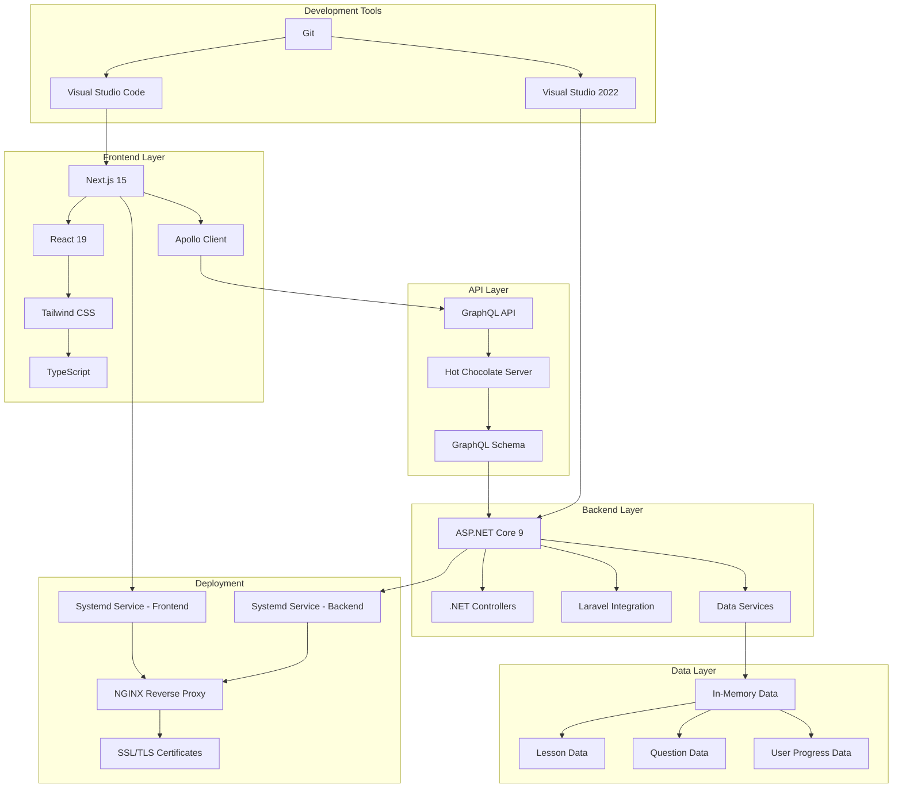

# GlassCode Academy - Fullstack Learning & Interview Trainer

## Project Overview

GlassCode Academy is a full-stack educational platform designed to help developers learn and prepare for interviews in modern web technologies. The application provides structured learning resources and realistic interview practice with instant feedback.

> **Note**: This is purely a learning and coding challenge! No real application would (or should) be architored this way. In the real world, you wouldn't run 5+ separate technology stacks just to teach about them. But for the sake of learning and demonstrating proficiency in each technology, we've gone a bit overboard with the architecture. Think of it as an educational extreme sport!

## Features

- **Learning Tracks**: Comprehensive lessons for .NET, Next.js, GraphQL, Laravel, React, Tailwind CSS, Node.js, and SASS
- **Step-by-Step Lessons**: Code examples with expected outputs
- **Interview Quizzes**: Multiple-choice and open-ended questions
  - Tier-weighted difficulty reporting and selection (see docs)
- **Progress Tracking**: Local storage-based progress tracking
- **Gamification**: Certificate rewards for completed modules
- **Modern UI**: Built with Next.js, React, and Tailwind CSS
- **Responsive Design**: Adapts to different screen sizes with a wider layout for better module visibility

## Technology Stack

### Frontend
- Next.js 15
- React 19
- TypeScript
- Tailwind CSS
- Apollo Client for GraphQL integration

### Backend
- ASP.NET Core 9 Web API (C#)
- GraphQL API (HotChocolate)
- In-memory data storage

## System Architecture

The application follows a full-stack architecture with a Next.js frontend and ASP.NET Core Web API backend, communicating via a GraphQL API.

> **Architectural Note**: We've also implemented a completely separate module-based architecture where each technology is implemented using its own stack. This is purely for educational purposes - a real application would use a more sensible unified approach!



## Directory Structure

```
GlassCodeAcademy/
├── glasscode/
│   ├── backend/
│   │   ├── Controllers/
│   │   ├── Data/ (JSON files with content for all technologies)
│   │   ├── GraphQL/
│   │   ├── Models/
│   │   ├── Services/
│   │   └── Program.cs
│   └── frontend/
│       ├── src/
│       │   ├── app/
│       │   │   ├── graphql/
│       │   │   ├── interview/
│       │   │   ├── lessons/
│       │   │   ├── nextjs/
│       │   │   ├── laravel/
│       │   │   ├── react/
│       │   │   ├── tailwind/
│       │   │   ├── node/
│       │   │   ├── sass/
│       │   │   └── page.tsx
│       │   ├── components/
│       │   └── apolloClient.ts
│       └── package.json
├── content/
│   ├── lessons/
│   │   ├── laravel-fundamentals.json
│   │   ├── node-fundamentals.json
│   │   └── ... (other module lessons)
│   ├── quizzes/
│   └── registry.json
├── laravel-backend/ (complete Laravel application structure)
└── README.md

## Quiz Difficulty & Reporting

We use tier-weighted difficulty targets to keep quizzes aligned with module tiers (e.g., foundational favors beginner content). A reporting script summarizes predicted per-attempt difficulty based on current pools:

- Script: `scripts/quiz-difficulty-report.js`
- Docs: `docs/QUIZ_DIFFICULTY.md`

Run:

```bash
node scripts/quiz-difficulty-report.js
```

This prints pool sizes and predicted beginner/intermediate/advanced counts per module using tier weights and quiz length.
```

## Question Schema & Authoring

We’ve standardized the question schema and added fields to better control multiple-choice presentation and open-ended validation:

- Multiple-choice
  - `fixedChoiceOrder` (boolean): prevents shuffling when order matters
  - `choiceLabels` (string): set to `letters` to render choices as `A. / B. / C. / D.`
- Open-ended
  - `acceptedAnswers` (array of strings): alternative correct phrasings (case-insensitive match)

Authoring guidelines and the full schema live in:
- `docs/QUESTION_TEMPLATE.md`
- `CONTRIBUTING.md`

## Automatic Migration: Letter-Labeled Fixed Order

A migration script updates existing quiz content that references lettered options or includes "All of the above" / "None of the above" to use fixed order with letter labels.

- Dry run (shows what would change):
  ```bash
  node scripts/migrate-lettered-questions.js --dry
  ```
- Apply changes:
  ```bash
  node scripts/migrate-lettered-questions.js
  ```

What it does:
- Scans `content/quizzes/*.json`
- For questions that reference letters in the prompt or choices, or include "All of the above"/"None of the above":
  - Sets `fixedChoiceOrder: true`
  - Sets `choiceLabels: "letters"`

After running, start the app and visit module quiz pages to confirm A/B/C/D prefixes and that affected questions no longer shuffle.

## Technology Modules Implementation

### Backend Technologies

#### .NET, Next.js, and GraphQL Modules
- Core modules with structured lessons and interview questions

#### Laravel Modules
1. **Standalone Laravel Backend**: A complete Laravel application structure with models, controllers, and routes
2. **GraphQL Integration**: Laravel content is seamlessly integrated into the .NET GraphQL API
3. **Data Synchronization**: Laravel content is stored as JSON files in the .NET backend but maintains the Laravel data structure

##### Laravel Content Structure
- Routing fundamentals (Basic Routing, Route Parameters)
- Eloquent ORM basics (Introduction to Eloquent, Querying Models)
- Blade templating (Blade Basics, Blade Control Structures)
- Middleware (Creating Middleware, Registering Middleware)
- Database (Migrations, Seeding Data)
- Authentication (Laravel Breeze, API Authentication)

##### Laravel Interview Questions
- 35 professional multiple-choice and open-ended questions covering core Laravel concepts

### Frontend Technologies

#### React Modules
1. **Component-Based Learning**: Lessons on React components, hooks, and state management
2. **Interactive Quizzes**: Interview questions covering React fundamentals and advanced concepts
3. **Technology-Specific Styling**: Blue-themed interface for React content

#### Tailwind CSS Modules
Utility-first CSS framework for rapid UI development

#### Node.js Modules
1. **Server-Side JavaScript**: Lessons on Node.js fundamentals and Express.js
2. **Interactive Quizzes**: Interview questions covering Node.js concepts
3. **Technology-Specific Styling**: Green-themed interface for Node.js content

#### SASS Modules
CSS preprocessor with variables, nesting, and mixins

## API Endpoints

All data is accessed through GraphQL queries and mutations:

### Queries
- `dotNetLessons`, `nextJsLessons`, `graphQLLessons`, `laravelLessons`
- `reactLessons`, `tailwindLessons`, `nodeLessons`, `sassLessons`
- `dotNetInterviewQuestions`, `nextJsInterviewQuestions`, `graphQLInterviewQuestions`, `laravelInterviewQuestions`
- `reactInterviewQuestions`, `tailwindInterviewQuestions`, `nodeInterviewQuestions`, `sassInterviewQuestions`

### Mutations
- `submitAnswer` (for all modules)
- `submitLaravelAnswer` (Laravel-specific)
- `submitReactAnswer` (React-specific)
- `submitTailwindAnswer` (Tailwind-specific)
- `submitNodeAnswer` (Node.js-specific)
- `submitSassAnswer` (SASS-specific)
- `trackProgress`

## Development Setup

### Prerequisites
- .NET 8.0 SDK or later
- Node.js 18+ and npm
- Git

### Quick Start (Development)

To start both frontend and backend services in development mode:

```bash
# Make the script executable
chmod +x start-dev.sh

# Run the development script
./start-dev.sh
```

This will start:
- Backend on `http://localhost:8080`
- Frontend on `http://localhost:3000`

### Contributing

Please read `CONTRIBUTING.md` for the content schema, validation workflow, auto-fix tools, and authoring guidelines.

### Manual Start (Development)

#### Backend Setup
```bash
cd glasscode/backend

# Make the script executable
chmod +x start-dev.sh

# Run the backend development script
./start-dev.sh
```

The backend will start on `http://localhost:8080` with:
- GraphQL API: `http://localhost:8080/graphql`
- GraphQL UI: `http://localhost:8080/graphql-ui`
- Health check: `http://localhost:8080/api/health`

#### Frontend Setup
```bash
cd glasscode/frontend

# Make the script executable
chmod +x start-dev.sh

# Run the frontend development script
./start-dev.sh
```

The frontend will start on `http://localhost:3000`

## Production Deployment

For production deployments, we provide a turn-key bootstrap script that automates the entire setup process:

### Automated Deployment

1. **Configure your environment**
   ```bash
   # Copy the example configuration file
   cp .env.example .env
   
   # Edit the configuration for your environment
   nano .env
   ```

2. **Run the bootstrap script**
   ```bash
   # Make the script executable
   chmod +x bootstrap.sh
   
   # Run the bootstrap script
   ./bootstrap.sh
   ```

The bootstrap script will:
1. Install all required dependencies (Node.js, .NET, NGINX, etc.)
2. Create a dedicated deploy user
3. Clone the repository
4. Build both frontend and backend applications
5. Set up systemd services for automatic startup
6. Configure NGINX as a reverse proxy
7. Set up SSL certificates with Let's Encrypt
8. Configure firewall rules
9. Perform health checks

### Configuration Options

The deployment can be customized using the `.env` configuration file:

- `APP_NAME`: Application name (used for service names)
- `DEPLOY_USER`: System user to run the application
- `APP_DIR`: Directory where the application will be installed
- `REPO`: Git repository to clone
- `DOMAIN`: Domain name for the application
- `EMAIL`: Email for SSL certificate registration

### Updating the Application

To update the application to the latest version:

```bash
# Make the update script executable
chmod +x update.sh

# Run the update script
./update.sh
```

The update script will:
1. Backup the current installation
2. Pull the latest changes from the repository
3. Update dependencies and rebuild the application
4. Restart services
5. Perform health checks

### Manual Steps (if not using bootstrap)

If you prefer to set up the server manually, follow these steps:

1. **Create deploy user**
   ```bash
   sudo adduser --disabled-password --gecos "" deploy
   sudo usermod -aG sudo deploy
   ```

2. **Install dependencies**
   ```bash
   # Node.js
   curl -fsSL https://deb.nodesource.com/setup_20.x | sudo -E bash -
   sudo apt-get install -y nodejs
   
   # .NET
   curl -sSL https://packages.microsoft.com/config/ubuntu/24.04/packages-microsoft-prod.deb -o packages-microsoft-prod.deb
   sudo dpkg -i packages-microsoft-prod.deb
   sudo apt-get update
   sudo apt-get install -y dotnet-sdk-8.0 aspnetcore-runtime-8.0
   ```

3. **Clone repository**
   ```bash
   sudo -u deploy git clone git@github.com:ErikVeland/GlassCodeAcademy.git /srv/academy
   ```

4. **Build applications**
   ```bash
   # Backend
   cd /srv/academy/glasscode/backend
   sudo -u deploy dotnet restore
   sudo -u deploy dotnet build -c Release
   
   # Frontend
   cd /srv/academy/glasscode/frontend
   sudo -u deploy npm ci
   sudo -u deploy npm run build
   ```

5. **Set up systemd services**
   Create `/etc/systemd/system/glasscode-dotnet.service` and `/etc/systemd/system/glasscode-frontend.service` as shown in the bootstrap script.

6. **Configure NGINX**
   Create NGINX configuration as shown in the bootstrap script.