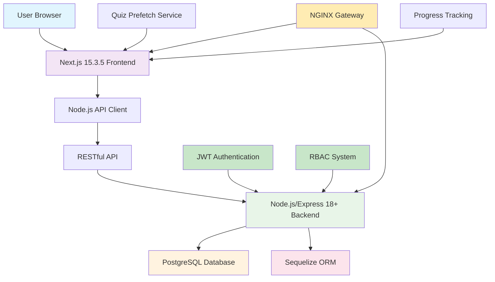

# GlassCode Academy Current Architecture

This document provides an up-to-date overview of the GlassCode Academy technology stack and architecture as of October 2025.

See also:
- [TECH_STACK.md](TECH_STACK.md) - Detailed technology stack information
- [TECH_STACK_INTEGRATION.md](TECH_STACK_INTEGRATION.md) - Technology integration details
- [CONTENT_STRUCTURE.md](CONTENT_STRUCTURE.md) - Content organization and structure
- [PROGRESS_REPORT.md](PROGRESS_REPORT.md) - Development progress and statistics

## Current Technology Stack

### Frontend
- **Next.js 15.3.5** - React framework with App Router
- **React 19.0.0** - Component-based UI library
- **TypeScript** - Typed JavaScript for improved development experience
- **Tailwind CSS** - Utility-first CSS framework
- **Sass** - CSS preprocessor

### Backend
- **Node.js/Express** - JavaScript runtime with Express framework
- **Sequelize ORM** - ORM for database operations
- **PostgreSQL** - Primary database (migrated from JSON files)
- **JWT** - Authentication and authorization
- **Jest** - Unit testing framework
- **Supertest** - API testing framework

### Development Tools
- **Node.js 18+** - JavaScript runtime for frontend and backend
- **Visual Studio Code** - Primary IDE for development
- **Git** - Version control system

## System Architecture



## Simplification Roadmap

### Current Architecture (Unified Node.js Stack)
The current architecture has been simplified to use a single backend technology:
- Node.js/Express for all backend functionality
- PostgreSQL as the primary database with Sequelize ORM
- Pure database-first approach with no JSON file dependencies
- Unified development patterns and practices across the entire backend

### Target Simplified Architecture
The simplification has been completed with:

1. **Backend Consolidation**
   - All functionality consolidated to Node.js/Express
   - Single backend technology stack for easier maintenance
   - Consistent development patterns and practices across the entire backend

2. **Database-First Approach**
   - Complete migration from hybrid JSON/database approach to pure database
   - All content managed through PostgreSQL with Sequelize ORM
   - Elimination of JSON file synchronization complexities

3. **Containerization**
   - Docker-based deployment for consistent environments
   - Simplified dependency management and deployment processes
   - Improved scalability and portability

4. **Unified Content Management**
   - Admin dashboard in Next.js for all content creation and editing
   - Real-time content updates without manual file editing
   - Improved user experience for content creators

## Deployment Architecture

The application is deployed using a standalone server approach with NGINX as a reverse proxy:

1. **NGINX** - Reverse proxy handling SSL termination and routing
2. **Frontend** - Next.js application served statically
3. **Backend** - Node.js/Express application running as a systemd service
4. **Database** - PostgreSQL database for persistent storage

## Data Flow

1. **User Request** - User accesses the application through NGINX
2. **Authentication** - JWT tokens are validated for protected endpoints
3. **Authorization** - Role-based access control determines access permissions
4. **Frontend Rendering** - Next.js renders pages and makes REST API requests
5. **REST API** - Frontend sends requests to the Node.js backend
6. **Data Processing** - Node.js/Express processes requests and queries PostgreSQL
7. **Logging** - Winston captures structured logs
8. **Response** - Data is returned through the REST API to the frontend

## Key Features

### Security Infrastructure

#### JWT Authentication
- Token-based authentication using JSON Web Tokens
- Secure token validation with signature verification
- Token expiration and refresh mechanisms
- Claims-based authorization

#### Role-Based Access Control (RBAC)
- Hierarchical role system (Admin, Instructor, Student, Guest)
- Policy-based authorization with custom requirements
- Organization and team-based scoping
- Multi-tenancy support

#### Structured Logging
- Comprehensive logging with Winston
- Correlation ID tracking across requests
- Structured log entries with contextual information
- Multiple output transports
- Performance timing and error tracking

### Quiz Prefetching
- Background service prefetches quizzes based on tier priority
- Foundational → Core → Specialized → Quality tier ordering
- Improves user experience by reducing loading times

### Progress Tracking
- Client-side progress tracking using localStorage
- Tier-based unlocking system
- Visual indicators for completion status

### Content Management
- Structured content organized by modules and tiers
- JSON-based content structure with standardized schemas
- Automated validation and quality control
- Database-first approach with Sequelize ORM

## Directory Structure

```
GlassCodeAcademy/
├── backend-node/                # Node.js/Express application
│   ├── src/
│   │   ├── controllers/         # Route controllers
│   │   ├── models/              # Data models
│   │   ├── routes/              # API routes
│   │   ├── services/            # Business logic services
│   │   ├── middleware/          # Custom middleware
│   │   ├── config/              # Configuration files
│   │   └── utils/               # Utility functions
│   ├── scripts/                 # Utility scripts
│   └── server.js                # Application entry point
├── glasscode/
│   └── frontend/                # Next.js application
│       ├── src/
│       │   ├── app/             # App router pages
│       │   ├── components/      # Reusable components
│       │   ├── hooks/           # Custom React hooks
│       │   └── lib/             # Utility functions
│       │       └── api/         # API client and hooks
│       └── public/              # Static assets
├── content/                     # Content files (lessons and quizzes)
│   ├── lessons/                 # Lesson content JSON files
│   ├── quizzes/                 # Quiz content JSON files
│   └── registry.json            # Content registry
├── docs/                        # Documentation
├── scripts/                     # Utility scripts
└── tests/                       # Test projects
    └── backend-node/tests/      # Backend unit and integration tests
```

## Development Workflow

### Prerequisites
- Node.js 18+
- PostgreSQL

### Quick Start
```bash
# Start development environment
./start-dev.sh

# This will start:
# - Backend on http://localhost:8080
# - Frontend on http://localhost:3000
```

### Production Deployment
```bash
# Configure environment
cp .env.example .env
# Edit .env with your configuration

# Run bootstrap script
chmod +x bootstrap.sh
./bootstrap.sh
```

## API Endpoints

### GraphQL
- **Endpoint**: `/graphql`
- **UI**: `/graphql-ui`

### Authentication
- **Validate Token**: `POST /api/auth/validate`
- **Refresh Token**: `POST /api/auth/refresh`
- **Revoke Token**: `POST /api/auth/revoke`
- **Token Info**: `POST /api/auth/info`

### Health Check
- **Endpoint**: `/api/health`

## Content Structure

### Modules
All content is organized into technology modules following a tiered approach:
1. **Foundational** - Basic programming concepts
2. **Core** - Main technology frameworks
3. **Specialized** - Advanced topics and patterns
4. **Quality** - Expert-level concepts and best practices

### Quiz Structure
Quizzes follow a standardized JSON schema with:
- Multiple-choice questions
- Open-ended questions
- Difficulty levels (Beginner, Intermediate, Advanced)
- Tier-based weighting for question selection

## Performance Optimizations

### Caching
- Redis cache for frequently accessed data
- Client-side caching with Apollo Client
- Quiz prefetching based on tier priority

### Database
- Indexes on frequently queried fields
- Connection pooling
- Efficient query patterns
- Entity Framework Core optimizations

### Frontend
- Server-side rendering
- Static site generation where appropriate
- Code splitting and lazy loading

## Testing Infrastructure

### Unit Testing
- xUnit testing framework
- Moq for mocking dependencies
- Comprehensive test coverage targets (80%+)
- Continuous integration with GitHub Actions

### Integration Testing
- Full API endpoint testing
- Database integration tests
- Security feature validation
- Performance benchmarking

### Code Quality
- Static code analysis
- Code coverage reporting
- Automated code quality checks
- Security scanning

## Monitoring and Observability

### Logging
- Structured logging with Serilog
- Correlation ID tracking
- Performance timing
- Error categorization and grouping

### Health Monitoring
- Application health checks
- Database connectivity monitoring
- Cache performance tracking
- API response time monitoring

## Recent Enhancements

### Security Improvements (October 2025)
- Implemented comprehensive JWT authentication
- Added role-based access control system
- Created organization and team constructs
- Enhanced authorization policies

### Observability Improvements (October 2025)
- Added structured logging with Serilog
- Implemented correlation ID tracking
- Standardized error response formats
- Added performance timing to operations

### Testing Infrastructure (October 2025)
- Enhanced test project with 100+ passing tests
- Added code coverage requirements (80% threshold)
- Implemented GitHub Actions CI/CD pipeline
- Added security feature integration tests

For detailed progress information, see [PROGRESS_REPORT.md](PROGRESS_REPORT.md).