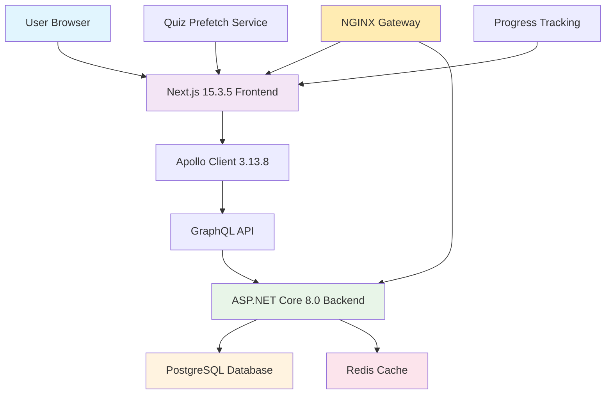

# GlassCode Academy Current Architecture

This document provides an up-to-date overview of the GlassCode Academy technology stack and architecture as of October 2025.

See also:
- [TECH_STACK.md](TECH_STACK.md) - Detailed technology stack information
- [TECH_STACK_INTEGRATION.md](TECH_STACK_INTEGRATION.md) - Technology integration details
- [CONTENT_STRUCTURE.md](CONTENT_STRUCTURE.md) - Content organization and structure

## Current Technology Stack

### Frontend
- **Next.js 15.3.5** - React framework with App Router
- **React 19.0.0** - Component-based UI library
- **TypeScript** - Typed JavaScript for improved development experience
- **Tailwind CSS** - Utility-first CSS framework
- **Apollo Client 3.13.8** - GraphQL client for data fetching
- **Sass** - CSS preprocessor

### Backend
- **ASP.NET Core 8.0** - Cross-platform web framework
- **HotChocolate 13.x** - GraphQL server for .NET
- **Entity Framework Core** - ORM for database operations
- **PostgreSQL** - Primary database (migrated from JSON files)
- **Redis** - Caching layer for improved performance

### Development Tools
- **Node.js 18+** - JavaScript runtime for frontend tooling
- **.NET 8.0 SDK** - Development SDK for backend
- **Visual Studio Code** - Primary IDE for frontend development
- **Visual Studio 2022** - IDE for backend development
- **Git** - Version control system

## System Architecture



## Deployment Architecture

The application is deployed using a standalone server approach with NGINX as a reverse proxy:

1. **NGINX** - Reverse proxy handling SSL termination and routing
2. **Frontend** - Next.js application served statically
3. **Backend** - ASP.NET Core application running as a systemd service
4. **Database** - PostgreSQL database for persistent storage
5. **Cache** - Redis for caching frequently accessed data

## Data Flow

1. **User Request** - User accesses the application through NGINX
2. **Frontend Rendering** - Next.js renders pages and makes GraphQL requests
3. **GraphQL API** - Apollo Client sends queries to the backend
4. **Data Processing** - ASP.NET Core processes requests and queries PostgreSQL
5. **Caching** - Redis cache is used for frequently accessed data
6. **Response** - Data is returned through the GraphQL API to the frontend

## Key Features

### Quiz Prefetching
- Background service prefetches quizzes based on tier priority
- Foundational → Core → Specialized → Quality tier ordering
- Improves user experience by reducing loading times

### Progress Tracking
- Client-side progress tracking using localStorage
- Tier-based unlocking system
- Visual indicators for completion status

### Content Management
- Structured content organized by modules and tiers
- JSON-based content structure with standardized schemas
- Automated validation and quality control

## Directory Structure

```
GlassCodeAcademy/
├── glasscode/
│   ├── backend/                 # ASP.NET Core application
│   │   ├── Controllers/         # API controllers
│   │   ├── Data/                # Database context and migrations
│   │   ├── GraphQL/             # GraphQL schema and resolvers
│   │   ├── Models/              # Data models
│   │   ├── Services/            # Business logic services
│   │   └── Program.cs           # Application entry point
│   └── frontend/                # Next.js application
│       ├── src/
│       │   ├── app/             # App router pages
│       │   ├── components/      # Reusable components
│       │   ├── hooks/           # Custom React hooks
│       │   └── lib/             # Utility functions
│       └── public/              # Static assets
├── content/                     # Content files (lessons and quizzes)
│   ├── lessons/                 # Lesson content JSON files
│   ├── quizzes/                 # Quiz content JSON files
│   └── registry.json            # Content registry
├── docs/                        # Documentation
└── scripts/                     # Utility scripts
```

## Development Workflow

### Prerequisites
- .NET 8.0 SDK
- Node.js 18+
- PostgreSQL
- Redis

### Quick Start
```bash
# Start development environment
./start-dev.sh

# This will start:
# - Backend on http://localhost:8080
# - Frontend on http://localhost:3000
```

### Production Deployment
```bash
# Configure environment
cp .env.example .env
# Edit .env with your configuration

# Run bootstrap script
chmod +x bootstrap.sh
./bootstrap.sh
```

## API Endpoints

### GraphQL
- **Endpoint**: `/graphql`
- **UI**: `/graphql-ui`

### Health Check
- **Endpoint**: `/api/health`

## Content Structure

### Modules
All content is organized into technology modules following a tiered approach:
1. **Foundational** - Basic programming concepts
2. **Core** - Main technology frameworks
3. **Specialized** - Advanced topics and patterns
4. **Quality** - Expert-level concepts and best practices

### Quiz Structure
Quizzes follow a standardized JSON schema with:
- Multiple-choice questions
- Open-ended questions
- Difficulty levels (Beginner, Intermediate, Advanced)
- Tier-based weighting for question selection

## Performance Optimizations

### Caching
- Redis cache for frequently accessed data
- Client-side caching with Apollo Client
- Quiz prefetching based on tier priority

### Database
- Indexes on frequently queried fields
- Connection pooling
- Efficient query patterns

### Frontend
- Server-side rendering
- Static site generation where appropriate
- Code splitting and lazy loading