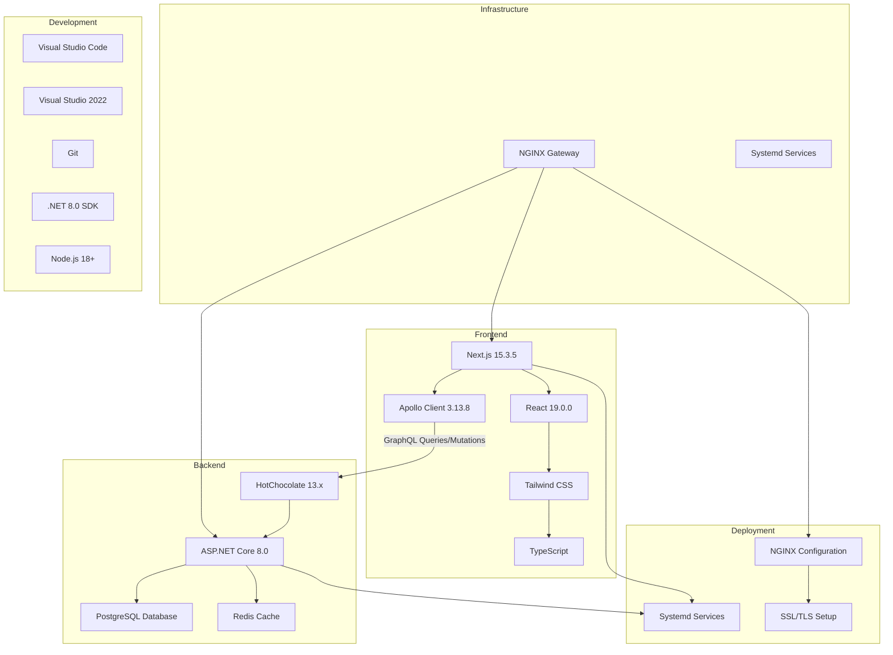

# GlassCode Academy Tech Stack

This document outlines the technology stack used in the GlassCode Academy application and how the different components integrate with each other.

For a complete overview of the current architecture, see [CURRENT_ARCHITECTURE.md](CURRENT_ARCHITECTURE.md).

## Architecture Overview

## Technology Components

### Frontend Technologies

1. **Next.js 15.3.5**
   - React framework with App Router
   - Server-side rendering and static site generation
   - API routes for backend integration
   - Built-in optimization features

2. **React 19.0.0**
   - Component-based UI library
   - Hooks for state management
   - Server Components for performance

3. **Tailwind CSS**
   - Utility-first CSS framework
   - Responsive design system
   - Technology-specific color schemes

4. **TypeScript**
   - Static typing for JavaScript
   - Improved developer experience
   - Better error detection

5. **Apollo Client 3.13.8**
   - GraphQL client for data fetching
   - Caching and state management
   - Integration with React components

### Backend Technologies

1. **ASP.NET Core 8.0**
   - Cross-platform web framework
   - High-performance runtime
   - Built-in dependency injection

2. **HotChocolate 13.x**
   - GraphQL server for .NET
   - Schema-first development
   - Real-time subscriptions support

3. **PostgreSQL Database**
   - Primary database for all content and user data
   - Migrating from hybrid JSON/database approach to pure database
   - Entity Framework Core ORM for data access

4. **Redis Cache**
   - Caching layer for improved performance
   - Session state management
   - Frequently accessed data storage

### Development Tools

1. **Visual Studio Code**
   - Frontend development environment
   - Extensions for Next.js and TypeScript

2. **Visual Studio 2022**
   - Backend development environment
   - Debugging and profiling tools

3. **Git**
   - Version control system
   - Collaboration workflow

4. **.NET 8.0 SDK (8.0.414+)**
   - Backend development runtime
   - Cross-platform development

5. **Node.js 18+**
   - Frontend development runtime
   - Package management with npm
   - Content validation and import scripts

### Infrastructure & Deployment

1. **NGINX Gateway**
   - Reverse proxy configuration
   - SSL/TLS termination
   - Load balancing

2. **Systemd Services**
   - Service management on Linux
   - Automatic startup and monitoring
   - Process management

3. **Standalone Server Deployment**
   - Self-hosted deployment option
   - Manual configuration
   - Full control over environment

## Simplification Roadmap

### Current State (Multi-stack Architecture)
The current architecture uses multiple backend technologies:
- ASP.NET Core for the main API and GraphQL services
- Laravel for some module-specific implementations
- Node.js for additional backend services
- JSON files for content storage with database migration in progress

### Future State (Simplified Architecture)
To reduce complexity and improve maintainability, the planned simplification includes:

1. **Backend Technology Consolidation**
   - **Current**: Multiple backend technologies (ASP.NET Core, Laravel, Node.js)
   - **Future**: Single ASP.NET Core backend for all functionality
   - **Benefits**: 
     - Reduced operational complexity
     - Lower deployment overhead
     - Simplified team knowledge requirements
     - Easier CI/CD pipeline management

2. **Pure Database Approach**
   - **Current**: Hybrid JSON/database content approach
   - **Future**: All content managed through PostgreSQL database
   - **Benefits**:
     - Eliminates complexity of JSON file synchronization
     - Single source of truth for all content
     - Real-time content updates without deployments
     - Simplified backup and recovery processes

3. **Containerization**
   - **Current**: Standalone server deployment with systemd services
   - **Future**: Docker-based deployment with container orchestration
   - **Benefits**:
     - Consistent environments across dev/staging/production
     - Easier scaling and deployment
     - Simplified dependency management
     - Improved portability and reproducibility

4. **Unified Content Management**
   - **Current**: Disparate content creation and editing mechanisms
   - **Future**: Admin dashboard in Next.js for all content management
   - **Benefits**:
     - Centralized content creation and editing
     - Real-time content updates
     - Improved user experience for content creators
     - Elimination of JSON file editing requirements

## Integration Flow

1. **Frontend to Backend Communication**
   - Apollo Client sends GraphQL queries to the ASP.NET Core backend
   - HotChocolate GraphQL server resolves queries
   - Data is fetched from PostgreSQL database
   - NGINX gateway routes requests to appropriate services

2. **Data Flow**
   - User interactions trigger GraphQL queries/mutations
   - GraphQL server routes requests to appropriate resolvers
   - Resolvers read from PostgreSQL database
   - Responses flow back through the GraphQL layer to the frontend

3. **Module Architecture**
   - All technology modules served by single ASP.NET Core backend
   - Content managed through unified database schema
   - Shared services and components across all modules

4. **Development Workflow**
   - Code changes are committed to Git
   - Local development using Docker Compose
   - Production deployment using container orchestration
   - NGINX handles SSL/TLS and reverse proxy
   - Services run as containers on the server

## Benefits of This Architecture

1. **Educational Focus**
   - Single backend technology for comprehensive learning
   - Real-world technology stack examples
   - Hands-on experience with modern development practices

2. **Modular Design**
   - Each technology module is self-contained
   - Independent development and deployment
   - Easy to add new learning modules

3. **Performance & Simplicity**
   - Database-first approach for fast content delivery
   - Caching with Redis for improved performance
   - Lightweight and efficient

4. **Production-Ready Infrastructure**
   - NGINX gateway for professional deployment
   - Containerized services for reliability
   - SSL/TLS support for security

5. **Developer Experience**
   - Type safety with TypeScript
   - Hot reloading during development
   - Multiple IDE support (VS Code, Visual Studio)
   - Comprehensive debugging tools

## Benefits of Simplification

1. **Reduced Complexity**
   - Single backend technology stack
   - Elimination of cross-technology integration challenges
   - Simplified debugging and troubleshooting

2. **Lower Maintenance Costs**
   - Fewer technologies to maintain and update
   - Reduced dependency management overhead
   - Simplified security patching

3. **Improved Developer Productivity**
   - Consistent development patterns across the entire codebase
   - Reduced context switching between different technologies
   - Easier onboarding for new team members

4. **Better Scalability**
   - Containerized deployment for easier scaling
   - Consistent performance characteristics
   - Simplified load balancing and clustering

5. **Enhanced Reliability**
   - Fewer points of failure
   - Consistent error handling and logging
   - Simplified monitoring and observability