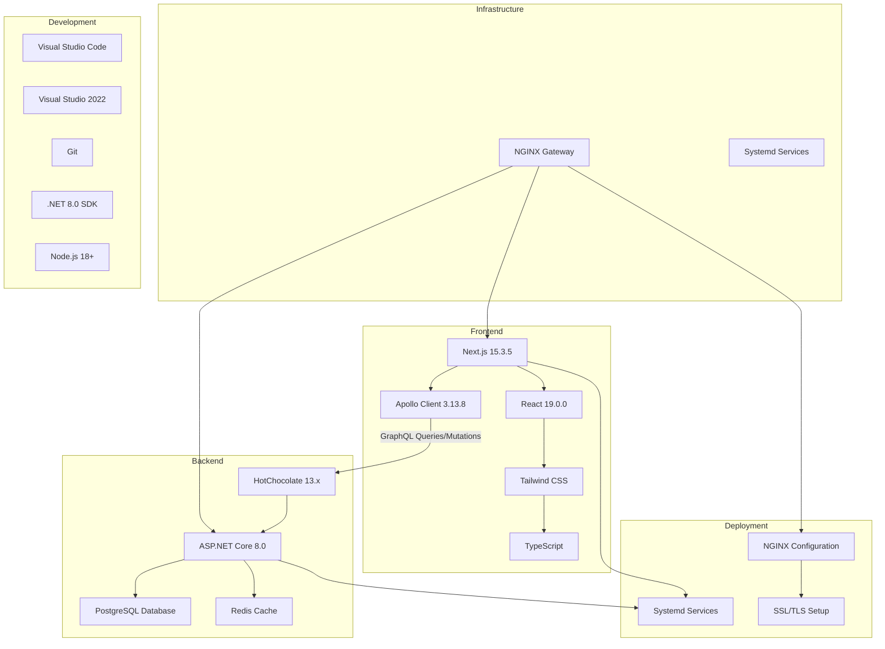

# GlassCode Academy Tech Stack

This document outlines the technology stack used in the GlassCode Academy application and how the different components integrate with each other.

For a complete overview of the current architecture, see [CURRENT_ARCHITECTURE.md](CURRENT_ARCHITECTURE.md).

## Architecture Overview

## Technology Components

### Frontend Technologies

1. **Next.js 15.3.5**
   - React framework with App Router
   - Server-side rendering and static site generation
   - API routes for backend integration
   - Built-in optimization features

2. **React 19.0.0**
   - Component-based UI library
   - Hooks for state management
   - Server Components for performance

3. **Tailwind CSS**
   - Utility-first CSS framework
   - Responsive design system
   - Technology-specific color schemes

4. **TypeScript**
   - Static typing for JavaScript
   - Improved developer experience
   - Better error detection

5. **Apollo Client 3.13.8**
   - GraphQL client for data fetching
   - Caching and state management
   - Integration with React components

### Backend Technologies

1. **ASP.NET Core 8.0**
   - Cross-platform web framework
   - High-performance runtime
   - Built-in dependency injection

2. **HotChocolate 13.x**
   - GraphQL server for .NET
   - Schema-first development
   - Real-time subscriptions support

3. **Laravel 11.0+**
   - PHP web application framework
   - Eloquent ORM for database operations
   - RESTful API endpoints

4. **Node.js Backends**
   - Express.js framework
   - Module-specific implementations
   - RESTful API endpoints

5. **JSON Data Files**
   - File-based data storage
   - Structured lesson content
   - Zero configuration setup

### Development Tools

1. **Visual Studio Code**
   - Frontend development environment
   - Extensions for Next.js and TypeScript

2. **Visual Studio 2022**
   - Backend development environment
   - Debugging and profiling tools

3. **Git**
   - Version control system
   - Collaboration workflow

4. **.NET 8.0 SDK (8.0.414+)**
   - Backend development runtime
   - Cross-platform development

5. **Node.js 18+**
   - Frontend development runtime
   - Package management with npm

6. **PHP 8.2+ and Composer**
   - Laravel module development
   - Dependency management

### Infrastructure & Deployment

1. **NGINX Gateway**
   - Reverse proxy configuration
   - SSL/TLS termination
   - Load balancing

2. **Systemd Services**
   - Service management on Linux
   - Automatic startup and monitoring
   - Process management

3. **Standalone Server Deployment**
   - Self-hosted deployment option
   - Manual configuration
   - Full control over environment

## Integration Flow

1. **Frontend to Backend Communication**
   - Apollo Client sends GraphQL queries to the ASP.NET Core backend
   - HotChocolate GraphQL server resolves queries
   - Data is fetched from JSON data files
   - Module-specific backends (Laravel, Node.js) serve their own content
   - NGINX gateway routes requests to appropriate services

2. **Data Flow**
   - User interactions trigger GraphQL queries/mutations
   - GraphQL server routes requests to appropriate resolvers
   - Resolvers read from structured JSON data files
   - Module-specific content is served by dedicated backends
   - Responses flow back through the GraphQL layer to the frontend

3. **Module Architecture**
   - Each technology module has its own backend implementation
   - Laravel modules use PHP with Eloquent ORM
   - Node.js modules use Express.js framework
   - React, Vue, and other frontend modules are served statically
   - All modules integrate through the NGINX gateway

4. **Development Workflow**
   - Code changes are committed to Git
   - Local development uses multiple service ports
   - Production deployment uses systemd services
   - NGINX handles SSL/TLS and reverse proxy
   - Services run as standalone processes on the server

## Benefits of This Architecture

1. **Educational Focus**
   - Multiple backend frameworks for comprehensive learning
   - Real-world technology stack examples
   - Hands-on experience with different paradigms

2. **Modular Design**
   - Each technology module is self-contained
   - Independent development and deployment
   - Easy to add new learning modules

3. **Performance & Simplicity**
   - JSON data files for fast content delivery
   - No database setup required
   - Lightweight and efficient

4. **Production-Ready Infrastructure**
   - NGINX gateway for professional deployment
   - Systemd services for reliability
   - SSL/TLS support for security

5. **Developer Experience**
   - Type safety with TypeScript
   - Hot reloading during development
   - Multiple IDE support (VS Code, Visual Studio)
   - Comprehensive debugging tools