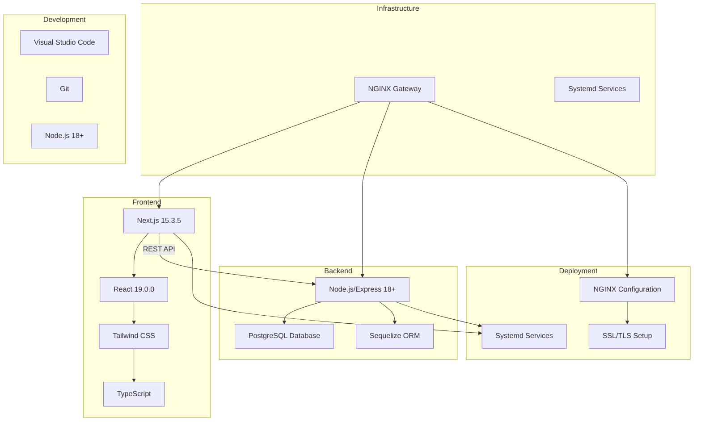

# GlassCode Academy Tech Stack

This document outlines the technology stack used in the GlassCode Academy application and how the different components integrate with each other.

For a complete overview of the current architecture, see [CURRENT_ARCHITECTURE.md](CURRENT_ARCHITECTURE.md).

## Architecture Overview

## Technology Components

### Frontend Technologies

1. **Next.js 15.3.5**
   - React framework with App Router
   - Server-side rendering and static site generation
   - API routes for backend integration
   - Built-in optimization features

2. **React 19.0.0**
   - Component-based UI library
   - Hooks for state management
   - Server Components for performance

3. **Tailwind CSS**
   - Utility-first CSS framework
   - Responsive design system
   - Technology-specific color schemes

4. **TypeScript**
   - Static typing for JavaScript
   - Improved developer experience
   - Better error detection

### Backend Technologies

1. **Node.js/Express 18+**
   - JavaScript runtime with Express framework
   - High-performance web server
   - Built-in middleware support
   - Logging with Winston (JSON, timestamped)

2. **PostgreSQL Database**
   - Primary database for all content and user data
   - Pure database approach with no JSON file dependencies
   - Sequelize ORM for data access

3. **Sequelize ORM**
   - Promise-based Node.js ORM for PostgreSQL
   - Model validation and associations
   - Migration support

4. **Testing**
   - Jest for unit tests
   - Supertest for API integration tests
   - Coverage via `npm run test:coverage`

### Development Tools

1. **Visual Studio Code**
   - Primary development environment
   - Extensions for Node.js and TypeScript
   - Integrated terminal and debugging

2. **Git**
   - Version control system
   - Collaboration workflow

3. **Node.js 18+**
   - Backend and frontend development runtime
   - Package management with npm
   - Content validation and import scripts

### Infrastructure & Deployment

1. **NGINX Gateway**
   - Reverse proxy configuration
   - SSL/TLS termination
   - Load balancing

2. **Systemd Services**
   - Service management on Linux
   - Automatic startup and monitoring
   - Process management

3. **PM2 Process Manager**
   - Node.js process management
   - Cluster mode for load balancing
   - Automatic restart on failures

4. **Docker Containers**
   - Containerized deployment
   - Consistent environments across dev/staging/production
   - Easy scaling and deployment

## Migration Milestone Achieved ✅

### Backend Technology Consolidation (Completed October 2025)
GlassCode Academy has successfully completed a major architectural transformation by migrating from a complex multi-technology stack to a unified Node.js/Express backend. This migration addressed all the issues identified in the previous architecture:

#### Migration Results:
- ✅ **Backend Consolidation**: All functionality consolidated to Node.js/Express
- ✅ **Database-First Approach**: Complete migration from hybrid JSON/database approach to pure database
- ✅ **Containerization**: Docker-based deployment for consistent environments
- ✅ **Unified Content Management**: Admin dashboard in Next.js for all content creation and editing

#### Benefits Achieved:
- ✅ **Reduced Operational Complexity**: Single backend technology stack
- ✅ **Improved Maintainability**: Consistent development patterns and practices
- ✅ **Enhanced Developer Productivity**: Unified JavaScript/TypeScript experience
- ✅ **Simplified CI/CD Pipeline**: Streamlined workflows with single project configuration
- ✅ **Better Performance**: Lower memory footprint and faster startup times
- ✅ **Easier Scaling**: Containerized deployment with PM2 process management

## Integration Flow

1. **Frontend to Backend Communication**
   - Frontend sends REST API requests to the Node.js/Express backend
   - Backend processes requests and queries PostgreSQL through Sequelize ORM
   - Responses are returned as JSON to the frontend

2. **Data Flow**
   - User interactions trigger REST API requests
   - Requests are routed to appropriate backend endpoints
   - Data is fetched from PostgreSQL database
   - Responses flow back through the API layer to the frontend

3. **Module Architecture**
   - All technology modules served by single Node.js/Express backend
   - Content managed through unified database schema
   - Shared services and components across all modules

4. **Development Workflow**
   - Code changes are committed to Git
   - Local development using Docker Compose
   - Production deployment using container orchestration
   - NGINX handles SSL/TLS and reverse proxy
   - Services run as containers on the server

## Benefits of This Architecture

1. **Educational Focus**
   - Single backend technology for comprehensive learning
   - Real-world technology stack examples
   - Hands-on experience with modern development practices

2. **Modular Design**
   - Each technology module is self-contained
   - Independent development and deployment
   - Easy to add new learning modules

3. **Performance & Simplicity**
   - Database-first approach for fast content delivery
   - Lightweight and efficient

4. **Production-Ready Infrastructure**
   - NGINX gateway for professional deployment
   - Containerized services for reliability
   - SSL/TLS support for security

5. **Developer Experience**
   - Type safety with TypeScript
   - Hot reloading during development
   - Multiple IDE support (VS Code, Visual Studio)
   - Comprehensive debugging tools

## Benefits of Simplification

1. **Reduced Complexity**
   - Single backend technology stack
   - Elimination of cross-technology integration challenges
   - Simplified debugging and troubleshooting

2. **Lower Maintenance Costs**
   - Fewer technologies to maintain and update
   - Reduced dependency management overhead
   - Simplified security patching

3. **Improved Developer Productivity**
   - Consistent development patterns across the entire codebase
   - Reduced context switching between different technologies
   - Easier onboarding for new team members

4. **Better Scalability**
   - Containerized deployment for easier scaling
   - Consistent performance characteristics
   - Simplified load balancing and clustering

5. **Enhanced Reliability**
   - Fewer points of failure
   - Consistent error handling and logging
   - Simplified monitoring and observability